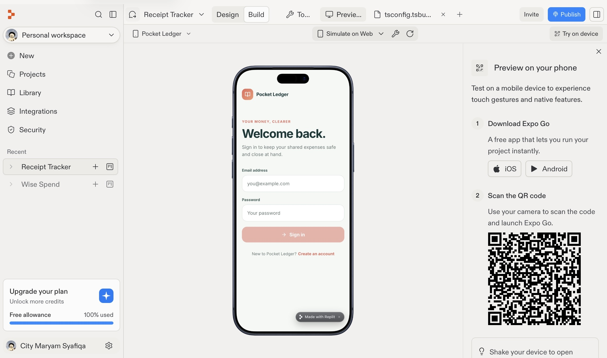
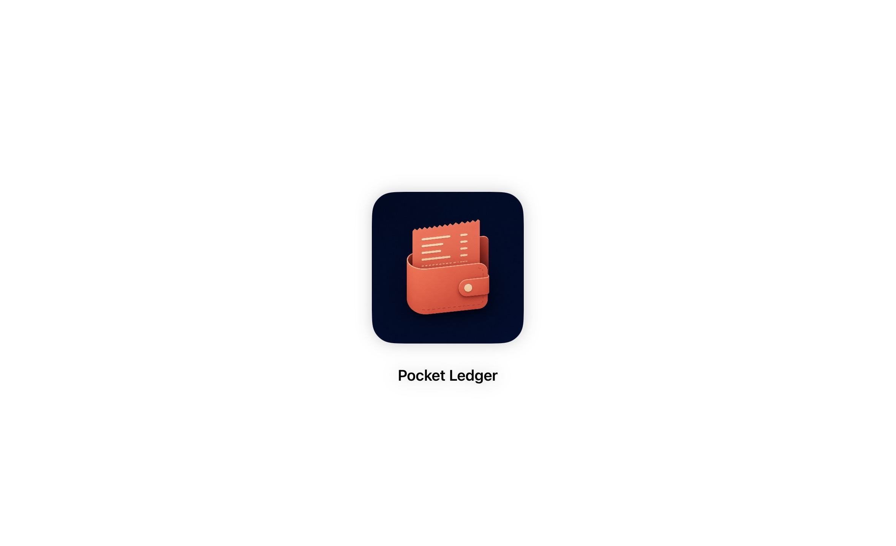
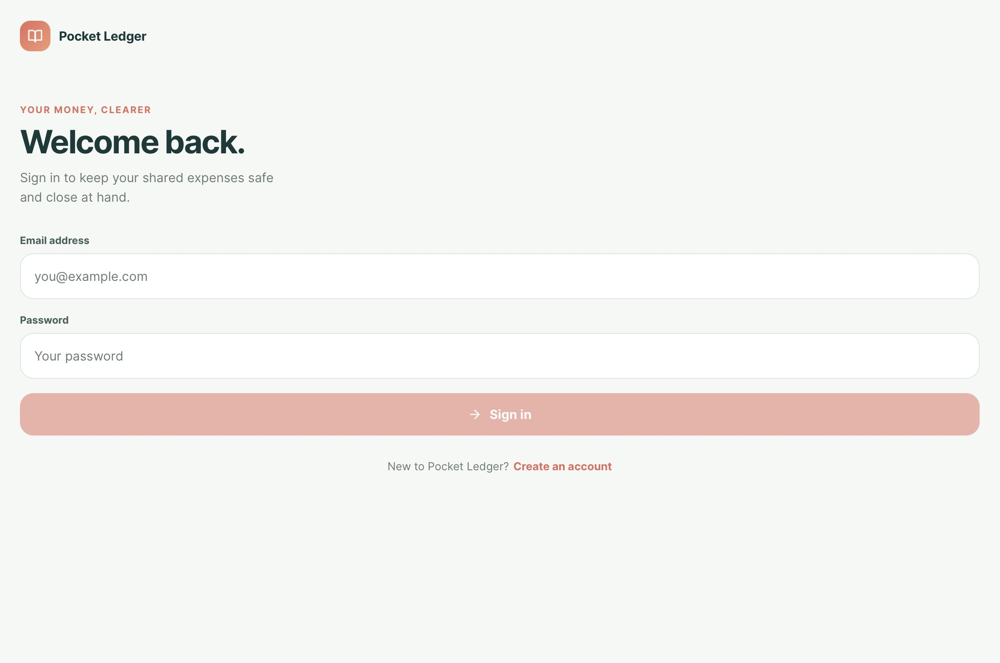
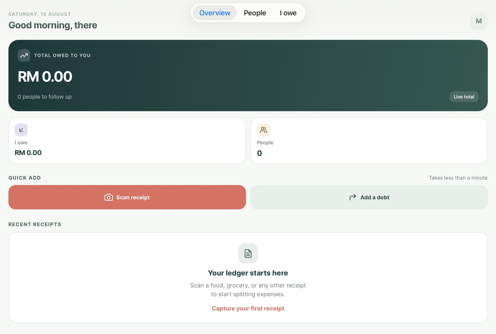
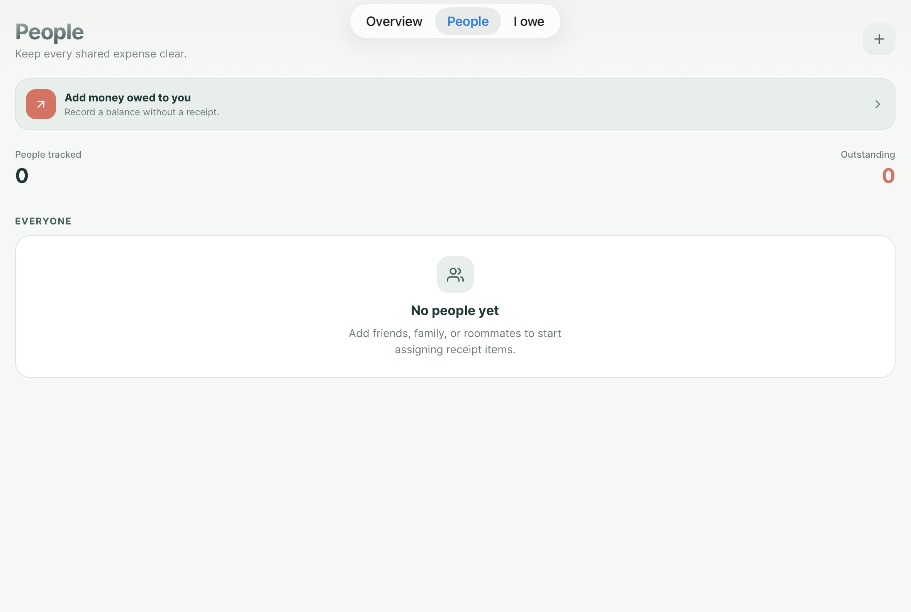
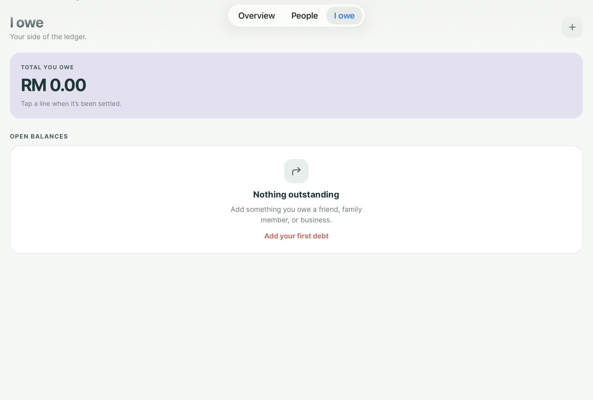
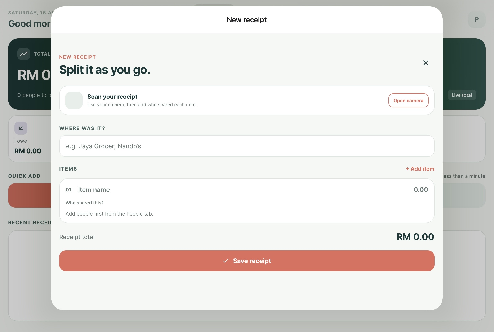
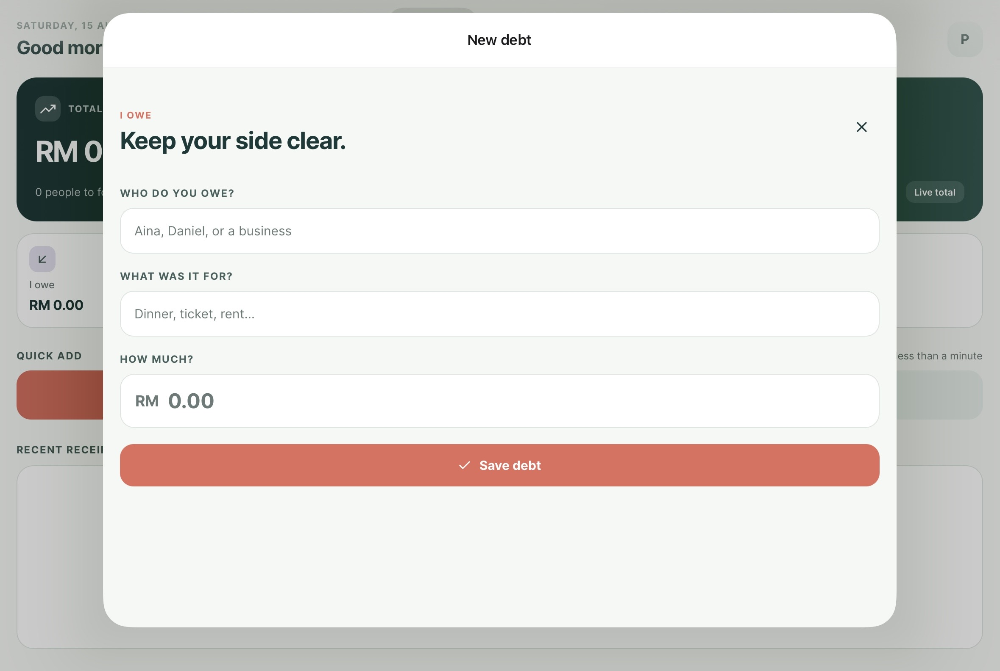

# 💰 Pocket Ledger

A mobile-friendly **debt and personal financial management application** built with Replit.

Pocket Ledger helps users keep track of shared expenses and personal debts in one place. Users can capture receipts, record individual items and prices, assign items to people, and automatically calculate how much each person owes.

> **⚠️ Development Status:** Pocket Ledger is currently **unfinished and under development**. The core features have been implemented and verified in the mobile preview, but several improvements and fixes are still planned.

---

## 📱 About the App

Pocket Ledger is designed to make tracking shared expenses easier.

For example, if you buy food for yourself and several friends, you can save the receipt, record the items and prices, and assign each item to the person who owes you. The app then calculates the amount each person owes automatically.

Users can also record money they personally owe to other people.

The application includes account authentication and data persistence so financial records can remain available after the app is closed.

---
# Screenshots
### Build

### Icon

### Login Page

### Overview Page

### People Page

### "I owe" Page

### Add New Receipt Page

### Add New Debt Page


---

## ✨ Current Features

### 🔐 Account & Security

- Secure account creation

- Sign in / login

- Email verification during registration

- User-specific financial data

### 🧾 Receipt Management

- Capture receipts using the phone camera

- Save receipts inside the application

- Manually enter receipt items

- Record individual item prices

- Assign items to specific people

- Keep receipt information for future reference

### 👥 Debt Tracking

- Add people to your debt list

- Assign individual receipt items to people

- Automatically calculate how much each person owes

- View each person's outstanding balance

- Track multiple people at the same time

### 💵 "Owed to Me"

The app provides an overview of money that other people owe you.

Users can view:

- Total money owed to you

- Number of people with outstanding balances

- Individual balances

- Items owed by each person

- Total amount owed by each person

### 💸 "I Owe"

Users can also keep track of money they owe to other people.

They can manually record:

- Person they owe

- Items or reason for the debt

- Amount owed

- Payment status

### ✅ Payment Tracking

- Mark debts as paid

- Track settled and unsettled payments

- Check individual payments from person detail pages

- Keep outstanding balances separate from settled debts

### 📊 Financial Overview

The main overview provides:

- **Total owed to you**

- **Total you owe**

- **Number of people with outstanding balances**

- **Recent receipts**

- Quick access to individual debt records

### 👤 Person Detail Pages

Selecting a person's name displays:

- Every item they owe

- Individual item prices

- Their total balance

- Payment status

- Settled and unsettled items

This makes it easier to understand exactly **what someone owes and why**.

### 💾 Data Persistence

The application currently includes local persistence so that recorded information remains available after closing the app.

---

## 📸 Receipt Workflow

The intended workflow is:

```text

Capture Receipt
      ↓
Save Receipt
      ↓
Enter / Review Items
      ↓
Enter Prices
      ↓
Assign Items to People
      ↓
Automatic Calculation
      ↓
View Individual Balances
      ↓
Mark Payments as Paid

```

---

## 🧮 Example

Imagine you pay for a meal containing:

| Item | Price | Person |
|---|---:|---|
| Burger | RM12 | Aina |
| Fries | RM6 | Aina |
| Drink | RM5 | Sarah |

Pocket Ledger calculates:

```text

Aina

Burger     RM12
Fries       RM6
----------------
Total      RM18


Sarah

Drink       RM5
----------------
Total       RM5

```

The overview would then show:

```text

Total owed to you: RM23
Outstanding people: 2

```

When Aina pays, her relevant debt can be marked as **paid**, updating her outstanding balance.

---

## 🎨 Design

Pocket Ledger uses a custom **Pocket Ledger** brand identity with a mobile-first interface.

The design aims to be:

- 📱 Mobile-friendly

- 🎨 Clean and approachable

- 💰 Focused on financial information

- 👥 Easy to understand when managing multiple people

- 🧾 Simple for recording receipts and expenses

---

## 🛠️ Development

The application was built and tested using **Replit**.

The current version has been:

- Built in a mobile application environment

- Tested using the mobile preview

- Verified for the implemented core features

- Tested for local data persistence

---

## 🚧 Known Limitations & Future Improvements

Pocket Ledger is **not finished yet**. Some features still require improvement.

### 🔍 Automatic Receipt Text Recognition

**Planned improvement:** Automatically recognize information from photographed receipts.

The current version requires receipt items and prices to be entered manually.

Future versions should be able to detect information such as:

```text

Receipt
   ↓
Camera Capture
   ↓
Text Recognition
   ↓
Item Names + Prices
   ↓
Review / Edit
   ↓
Save to Ledger

```

This will reduce the amount of manual data entry required.

### ☁️ Cross-Device Synchronization

**Planned improvement:** Synchronize the user's ledger across devices.

The current version relies on local persistence. A future version should allow users to sign in on another device and access the same receipts, people, debts, and payment records.

```text

Device A
   ↓
      ☁️ Cloud Database
   ↓
Device B

```

### 🐛 Ongoing Improvements

Because the application is still under development, some bugs, UI issues, and unfinished behaviors may remain.

These will be addressed as development continues.

---

## 🗺️ Development Roadmap

### Current Version

- [x] Account creation

- [x] Email verification

- [x] Sign in

- [x] Receipt capture

- [x] Manual item entry

- [x] Manual price entry

- [x] Assign items to people

- [x] Automatic debt calculations

- [x] Financial overview

- [x] Person detail pages

- [x] Payment tracking

- [x] "I Owe" section

- [x] Local persistence

- [x] Mobile preview testing

### Next Improvements

- [ ] Automatic receipt text recognition

- [ ] Cloud data synchronization

- [ ] Cross-device access

- [ ] Improve remaining bugs and unfinished features

- [ ] Further UI/UX improvements

---

## 🎯 Project Purpose

Pocket Ledger was created as a practical financial management project focused on solving a common problem: **keeping track of shared expenses and personal debts without manually calculating everything.**

The project also demonstrates the development of a mobile application involving:

- User authentication

- Data management

- Receipt processing

- Automatic calculations

- Personal financial tracking

- Mobile UI/UX design

- Persistent application data

---

## 📌 Project Status

**Status:** 🚧 In Development

The current version is functional enough for testing through the mobile preview, but it should **not be considered the final release**.

The main upcoming priorities are automatic receipt recognition, cloud synchronization, and resolving remaining issues.

---

## 👩‍💻 Project

**Pocket Ledger**  

A personal debt and expense management mobile application.

Built with **Replit** and developed as a practical software project.
